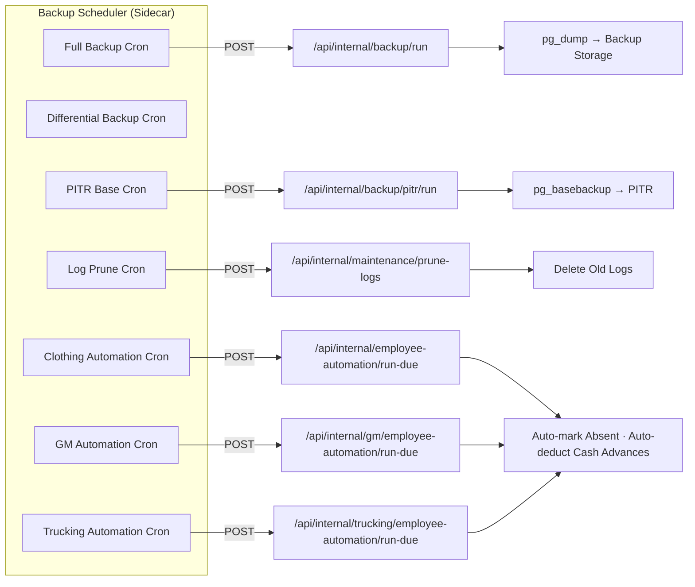
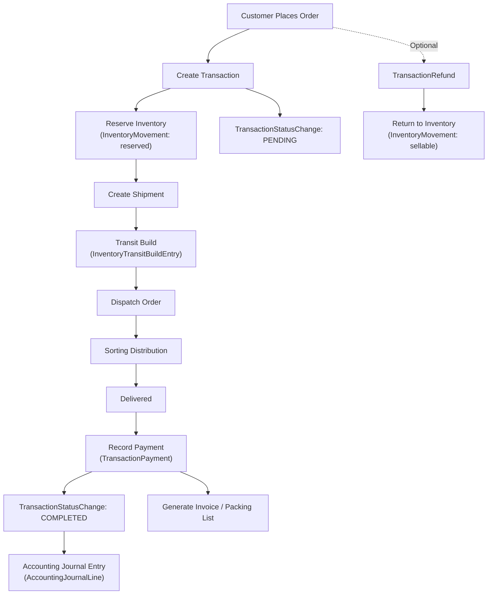
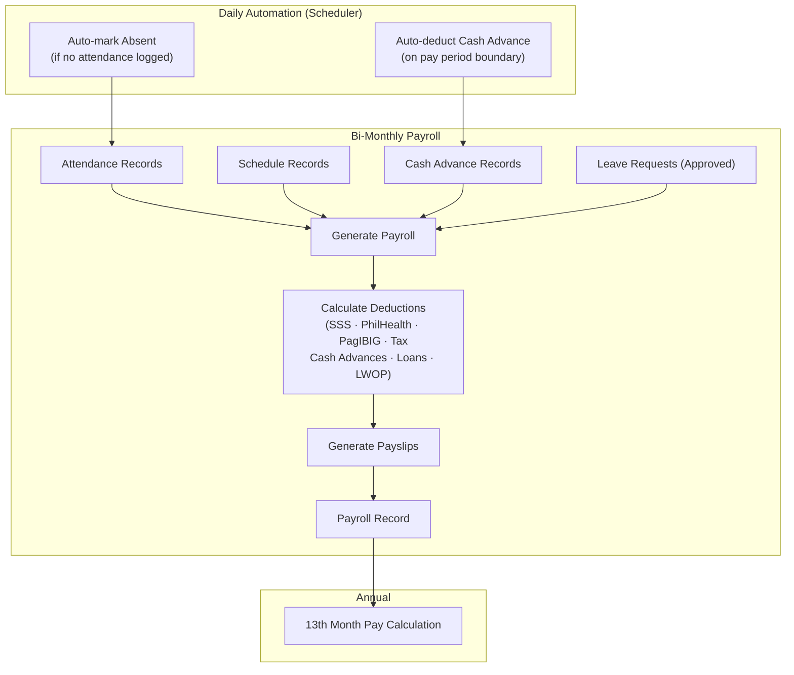
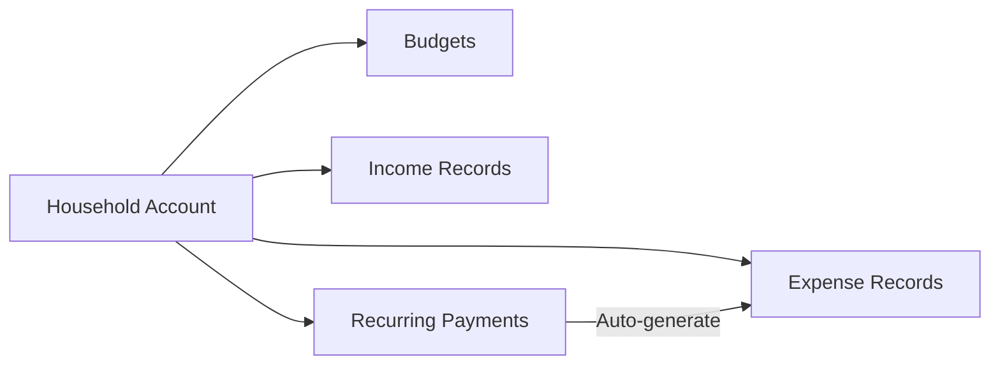
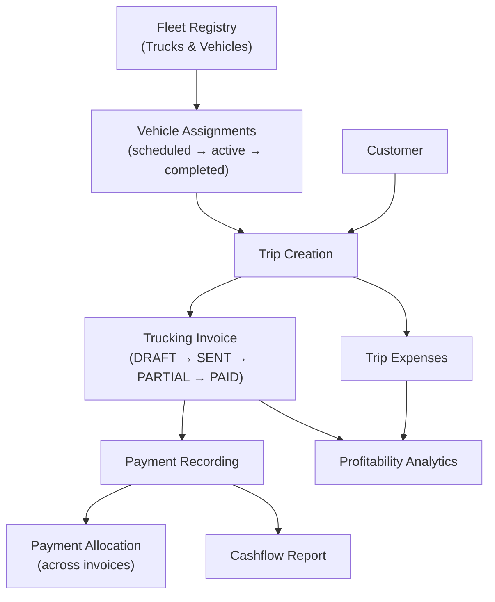
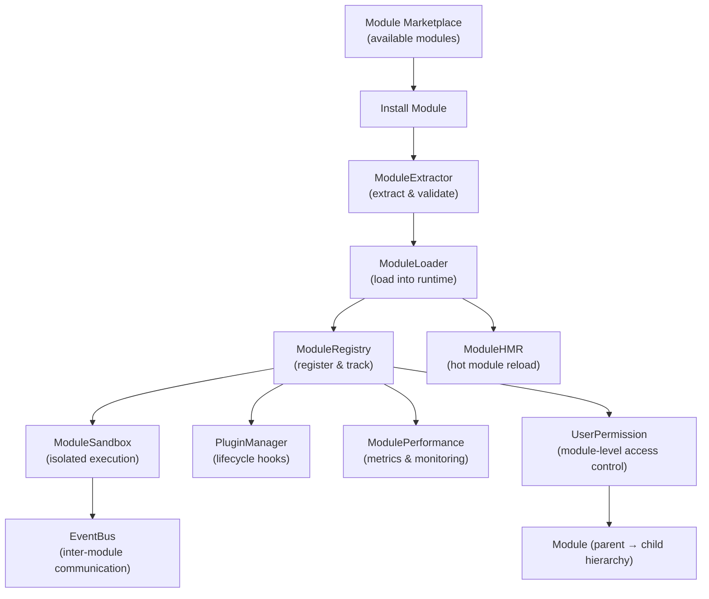
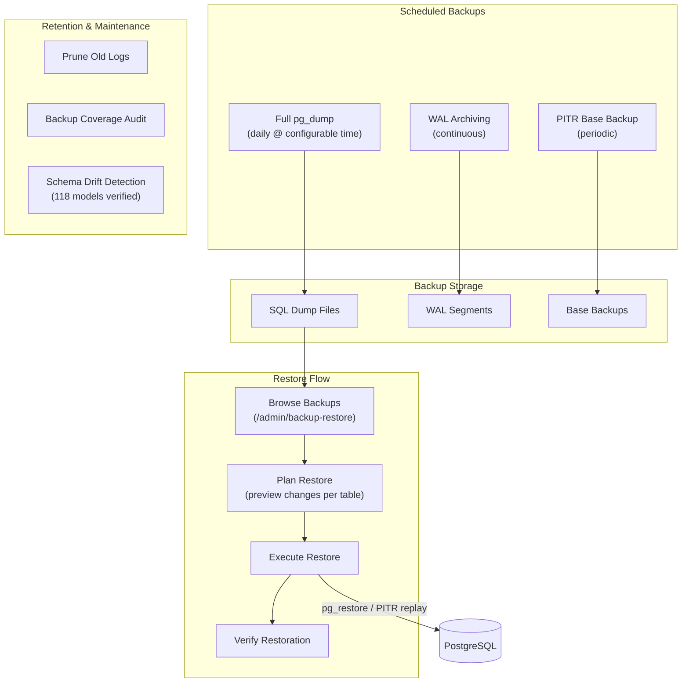
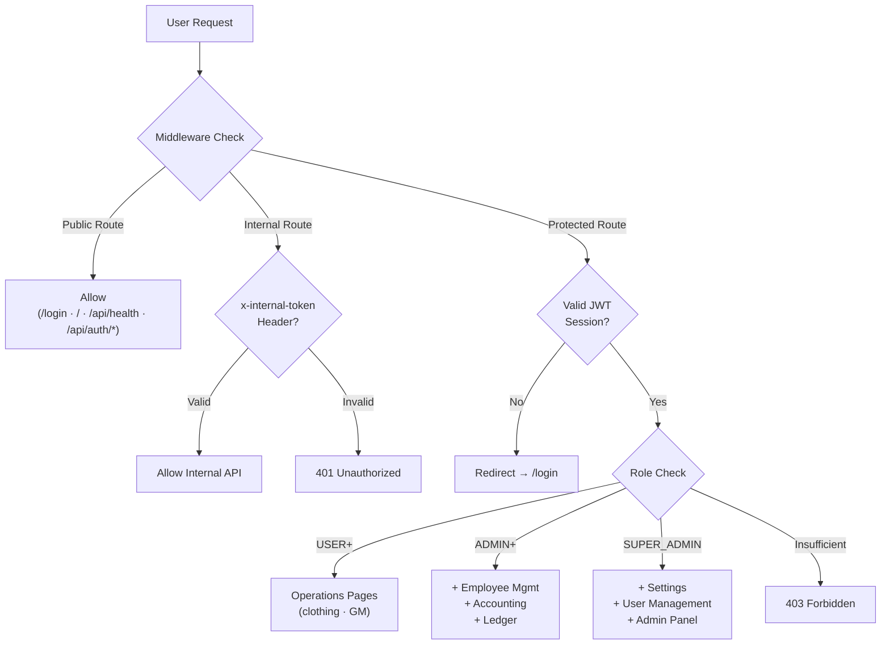

# Business Management System — Architecture Diagram

> Auto-generated: April 12, 2026

```mermaid
graph TB
    %% ════════════════════════════════════════════════════════════════
    %% INFRASTRUCTURE LAYER
    %% ════════════════════════════════════════════════════════════════

    subgraph DOCKER["🐳 Docker Compose — Production Stack"]
        direction TB

        subgraph DB_SVC["PostgreSQL 16 (db)"]
            POSTGRES[(PostgreSQL 16<br/>Port 5432)]
            WAL["WAL Archiving<br/>(PITR)"]
            POSTGRES --- WAL
        end

        subgraph APP_SVC["Next.js Application (app)"]
            NEXTJS["Next.js 14<br/>Port 5000"]
            HEALTH_EP["/api/health"]
            NEXTJS --- HEALTH_EP
        end

        subgraph BACKUP_SVC["Backup Scheduler (backup-scheduler)"]
            SCHEDULER["run-backup-scheduler.js<br/>Cron Triggers"]
        end

        subgraph RESTORE_SVC["Restore Runner (restore-runner)"]
            RESTORER["Restore Runner<br/>Docker Socket Access"]
        end

        SCHEDULER -->|"HTTP + internal token"| NEXTJS
        RESTORER -->|"Docker API"| APP_SVC
        NEXTJS -->|"Prisma ORM"| POSTGRES
        RESTORER -->|"pg_restore"| POSTGRES
    end

    %% ════════════════════════════════════════════════════════════════
    %% EXTERNAL INTEGRATIONS
    %% ════════════════════════════════════════════════════════════════

    subgraph EXTERNAL["☁️ External Services"]
        SENTRY["Sentry<br/>Error Tracking"]
        GDRIVE["Google Drive<br/>File Sync"]
        SMTP_SVC["SMTP Server<br/>Email (Password Reset)"]
        NEXTAUTH_PROVIDER["NextAuth.js<br/>JWT Sessions"]
    end

    NEXTJS --> SENTRY
    NEXTJS --> GDRIVE
    NEXTJS --> SMTP_SVC
    NEXTJS --> NEXTAUTH_PROVIDER

    %% ════════════════════════════════════════════════════════════════
    %% APPLICATION ARCHITECTURE
    %% ════════════════════════════════════════════════════════════════

    subgraph APP["📦 Next.js Application Architecture"]
        direction TB

        %% ── Middleware ──
        subgraph MW["🔐 Middleware Layer"]
            AUTH_MW["Authentication<br/>(NextAuth JWT)"]
            RBAC_MW["Role-Based Access<br/>USER · ADMIN · SUPER_ADMIN<br/>(src/core/routePermissions.ts)"]
            INTERNAL_TOKEN["Internal Job Token<br/>(x-internal-token header)"]
        end

        %% ── Frontend Pages ──
        subgraph PAGES["🖥️ Frontend Pages (Next.js App Router)"]
            direction TB

            subgraph AUTH_PAGES["Authentication"]
                LOGIN["/login"]
                FORGOT_PW["/forgot-password"]
                RESET_PW["/reset-password"]
            end

            subgraph CLOTHING_PAGES["Clothing Division"]
                CL_OPS["/clothing/operations"]
                CL_EMP["/clothing/employees"]
                CL_ACC["/clothing/accounting"]
            end

            subgraph GM_PAGES["General Merchandise Division"]
                GM_OPS["/general-merchandise/operations"]
                GM_EMP["/general-merchandise/employees"]
                GM_ACC["/general-merchandise/accounting"]
            end

            subgraph TRUCKING_PAGES["Trucking Division"]
                TR_OPS["/trucking/operations"]
                TR_EMP["/trucking/employees"]
                TR_EXP["/trucking/expenses"]
                TR_INV["/trucking/invoices"]
                TR_PAY["/trucking/payments"]
                TR_RPT["/trucking/reports"]
                TR_ANALYTICS["/trucking/analytics"]
            end

            subgraph PERSONAL_PAGES["Personal Finance"]
                P_DASH["/personal/dashboard"]
                P_ACCT["/personal/accounts"]
                P_BUDGET["/personal/budgets"]
                P_INC["/personal/income"]
                P_EXP["/personal/expenses"]
                P_RPT["/personal/reports"]
                P_SETTINGS["/personal/settings"]
            end

            subgraph ADMIN_PAGES["Admin"]
                ADMIN_DASH["/admin"]
                ADMIN_BACKUP["/admin/backup-restore"]
                ADMIN_CHANGELOG["/admin/change-log"]
            end

            PROFILE["/profile"]
            SETTINGS["/settings"]
        end

        %% ── Operations Subpages ──
        subgraph OPS_FEATURES["📊 Operations Features (per division)"]
            OPS_DASH["Dashboard"]
            OPS_PRODUCTS["Products"]
            OPS_INVENTORY["Inventory"]
            OPS_CUSTOMERS["Customers · [id]"]
            OPS_TRANSACTIONS["Transactions"]
            OPS_SHIPMENTS["Shipments"]
            OPS_DISPATCH["Dispatch / Dispatching"]
            OPS_SORTING["Sorting Distribution"]
            OPS_PRICES["Prices"]
            OPS_CHECKOUT["Checkout Links"]
            OPS_BI["Business Intelligence"]
            OPS_MSG["Messaging"]
            OPS_MSG_TPL["Message Templates"]
            OPS_POST_TPL["Post Template"]
            OPS_NOTIF["Notifications"]
            OPS_SETTINGS["Division Settings"]
        end

        CL_OPS --> OPS_FEATURES
        GM_OPS --> OPS_FEATURES

        %% ── Employee Subpages ──
        subgraph EMP_FEATURES["👥 Employee Features (per division)"]
            EMP_DASH["Dashboard"]
            EMP_TEAM["Team · [id]"]
            EMP_ATTENDANCE["Attendance"]
            EMP_CALENDAR["Calendar"]
            EMP_SCHEDULES["Schedules"]
            EMP_PAYROLL["Payroll"]
            EMP_CASH_ADV["Cash Advance"]
            EMP_LOANS["Employee Loans"]
            EMP_LEAVE["Leave Tracker"]
            EMP_13TH["13th Month Pay"]
            EMP_EXPENSES["Expenses"]
            EMP_NOTIF["Notifications"]
            EMP_SETTINGS["HR Settings"]
            EMP_TRIPS["Trips (Trucking only)"]
        end

        CL_EMP --> EMP_FEATURES
        GM_EMP --> EMP_FEATURES
        TR_EMP --> EMP_FEATURES

        %% ── Accounting Subpages ──
        subgraph ACC_FEATURES["📒 Accounting Features (per division)"]
            ACC_JOURNAL["Journal"]
            ACC_LEDGER["Ledger"]
            ACC_BS["Balance Sheet"]
            ACC_PL["Profit & Loss"]
            ACC_EXPENSES["Expenses"]
        end

        CL_ACC --> ACC_FEATURES
        GM_ACC --> ACC_FEATURES

        %% ── Trucking Operations ──
        subgraph TR_OPS_FEATURES["🚛 Trucking Operations"]
            TR_FLEET["Fleet Registry · [id]"]
            TR_TRIPS_OP["Trips Management"]
            TR_TRUCK_ASSIGN["Truck Assignments"]
            TR_VEH_ASSIGN["Vehicle Assignments"]
            TR_PROFITABILITY["Profitability Analytics"]
            TR_CASHFLOW["Cashflow Reports"]
        end

        TR_OPS --> TR_OPS_FEATURES

        %% ── API Layer ──
        subgraph API["⚡ API Routes — 253 Endpoints"]
            direction TB

            subgraph API_AUTH["Auth APIs"]
                API_NEXTAUTH["/api/auth/[...nextauth]"]
                API_REDIRECT["/api/auth/redirect"]
                API_PW_FORGOT["/api/auth/password/forgot"]
                API_PW_RESET["/api/auth/password/reset"]
            end

            subgraph API_USERS["User & Permissions APIs"]
                API_USERS_CRUD["/api/users · [id]"]
                API_USERS_PERMS["/api/users/[id]/permissions"]
                API_USERS_PROFILE["/api/users/profile · photo"]
                API_USERS_MSG["/api/users/messaging"]
                API_PERMS_CHECK["/api/permissions/check"]
            end

            subgraph API_EMPLOYEES["Employee APIs (×3 divisions)"]
                API_EMP_CRUD["/api/employees · [id]"]
                API_EMP_ATTEND["/api/attendance"]
                API_EMP_SCHED["/api/schedules"]
                API_EMP_PAYROLL["/api/payroll · generate · payslips"]
                API_EMP_CASH["/api/cash-advances"]
                API_EMP_LEAVE["/api/leave-requests · [id]"]
                API_EMP_13TH["/api/thirteenth-month-pay"]
                API_EMP_EXPENSE["/api/expenses · [id]"]
                API_EMP_AUTO["/api/employee-automation-settings"]
                API_EMP_SALARY["/api/employees/[id]/salary-history"]
            end

            subgraph API_PRODUCTS["Product & Inventory APIs (×2 divisions)"]
                API_PROD_CRUD["/api/products · [id]"]
                API_PROD_TRANSIT["/api/products/transit-build"]
                API_INV_STOCK["/api/inventory/check-stock"]
                API_INV_MOVE["/api/inventory/movements"]
                API_BUNDLES["/api/bundles"]
                API_MIX_MATCH["/api/mix-and-match"]
                API_WEIGHTS["/api/item-weights"]
                API_PRICES_CRUD["/api/prices · [id]"]
            end

            subgraph API_CUSTOMERS["Customer APIs (×2 divisions)"]
                API_CUST_CRUD["/api/customers · [id]"]
                API_CUST_INFO["/api/customers/[id]/additional-info"]
                API_CUST_PAY["/api/customers/[id]/payments · [paymentId]"]
                API_CUST_REFUND["/api/customers/[id]/refunds · [refundId]"]
                API_CUST_ORDERS["/api/customers/[id]/orders"]
                API_CUST_TRANS["/api/customers/[id]/transactions"]
                API_CUST_EXPORT["/api/customers/export · import"]
                API_CUST_SHOPEE["/api/customers/with-shopee"]
            end

            subgraph API_TRANSACTIONS["Transaction & Payment APIs (×2 divisions)"]
                API_TXN_CRUD["/api/transactions · [id]"]
                API_TXN_BULK_PAY["/api/transactions/payments/bulk"]
                API_CHECKOUT["/api/checkout-links"]
            end

            subgraph API_INVOICES["Invoice APIs (×2 divisions)"]
                API_INV_CRUD["/api/invoices · tickbox"]
                API_INV_GEN["/api/generate-invoice"]
                API_INV_PACKING["/api/generate-packing-list"]
                API_INV_DIST["/api/generate-distribution"]
                API_INV_TRANSIT["/api/generate-in-transit-invoice"]
                API_INV_SETTINGS["/api/invoice-settings · reset"]
                API_INV_CALC["/api/invoices/calculate-weights"]
            end

            subgraph API_SHIPMENTS["Shipment & Dispatch APIs (×2 divisions)"]
                API_SHIP_CRUD["/api/shipments · [id]"]
                API_SHIP_TRANSIT["/api/shipments/[id]/transit-build"]
                API_SHIP_RECLASS["/api/shipments/[id]/transit-reclass"]
                API_DISPATCH["/api/dispatch/orders"]
                API_SORTING["/api/sorting-distribution"]
            end

            subgraph API_ACCOUNTING["Accounting APIs (×2 divisions)"]
                API_ACC_JOURNAL["/api/accounting/journal"]
                API_ACC_LEDGER["/api/accounting/ledger"]
                API_ACC_BS["/api/accounting/balance-sheet"]
                API_ACC_PL["/api/accounting/profit-loss · details"]
                API_ACC_OPEN["/api/accounting/opening-balance"]
                API_ACC_MANUAL["/api/accounting/manual-journal"]
                API_ACC_JREF["/api/accounting/journal-lines-by-ref"]
                API_ACC_TRANSIT["/api/accounting/transit-build"]
                API_ACC_RECUR["/api/accounting/recurring-payments/*"]
            end

            subgraph API_TRUCKING["Trucking-Specific APIs"]
                API_TR_EMP["/api/trucking/employees · [id]"]
                API_TR_TRIPS["/api/trucking/trips · [id] · finalize"]
                API_TR_FLEET["/api/trucking/fleet-vehicles · [id]"]
                API_TR_VEH["/api/trucking/vehicle-assignments · [id]"]
                API_TR_INV["/api/trucking/invoices · generate"]
                API_TR_PAY["/api/trucking/payments"]
                API_TR_EXP["/api/trucking/expenses · [id]"]
                API_TR_PROFIT["/api/trucking/analytics/profitability"]
            end

            subgraph API_HOUSEHOLD["Household / Personal APIs"]
                API_HH_ACCT["/api/household/accounts"]
                API_HH_BUDGET["/api/household/budgets"]
                API_HH_INC["/api/household/income"]
                API_HH_EXP["/api/household/expenses · [id]"]
                API_HH_RECUR["/api/household/recurring-payments"]
            end

            subgraph API_MESSAGING["Messaging APIs"]
                API_CONV["/api/conversations · [id]/messages"]
                API_CONV_READ["/api/conversations/[id]/read"]
                API_CONV_UNREAD["/api/conversations/unread-count"]
                API_MSG_TPL["/api/message-templates"]
                API_POST_TPL["/api/post-template-notice"]
                API_OPS_NOTIF["/api/operations/notifications"]
            end

            subgraph API_BACKUP["Backup & Restore APIs"]
                API_BACKUP_LIST["/api/backup · [timestamp]"]
                API_BACKUP_PLAN["/api/backup/[timestamp]/plan"]
                API_BACKUP_CHANGES["/api/backup/[timestamp]/changes"]
                API_BACKUP_PITR["/api/backup/pitr · wal · bases · audit"]
                API_RESTORE["/api/restore · run"]
            end

            subgraph API_INTERNAL["Internal / Cron APIs"]
                API_INT_BACKUP["/api/internal/backup/run"]
                API_INT_PITR["/api/internal/backup/pitr/run"]
                API_INT_PRUNE["/api/internal/maintenance/prune-logs"]
                API_INT_INV["/api/internal/inventory/controls"]
                API_INT_AUTO_CL["/api/internal/employee-automation/run-due"]
                API_INT_AUTO_GM["/api/internal/.../gm/employee-automation/run-due"]
                API_INT_AUTO_TR["/api/internal/.../trucking/employee-automation/run-due"]
            end

            subgraph API_SYSTEM["System & Module APIs"]
                API_HEALTH["/api/health"]
                API_MODULES["/api/modules · install · update · uninstall"]
                API_MARKETPLACE["/api/marketplace/modules"]
                API_CHANGELOG["/api/change-log"]
                API_VERSIONS["/api/version-history · sync"]
                API_DOCS["/api/docs/spec (OpenAPI)"]
                API_SETTINGS["/api/settings/* (4 endpoints)"]
                API_GDRIVE["/api/google-drive/sync-files"]
            end
        end

        %% ── Service Layer ──
        subgraph SERVICES["🔧 Service Layer"]
            SVC_BASE["BaseService"]
            SVC_CUSTOMER["CustomerService"]
            SVC_PRODUCT["ProductService"]
            SVC_PRICE["PriceService"]
            SVC_TRANSACTION["TransactionService"]
            SVC_GM_TRANSACTION["GM TransactionService"]
            SVC_SHIPMENT["ShipmentService"]
            SVC_EXPENSE["ExpenseService"]
            SVC_LEAVE["LeaveRequestService"]
            SVC_FORMATTER["FormatterService"]
            SVC_VALIDATION["ValidationService"]
            SVC_MESSAGING["MessagingService"]
            SVC_CL_RECUR["ClothingRecurringPaymentService"]
            SVC_GM_RECUR["GM RecurringPaymentService"]
            SVC_HH_ACCT["HouseholdAccountService"]
            SVC_HH_BUDGET["HouseholdBudgetService"]
            SVC_HH_INC["HouseholdIncomeService"]
            SVC_HH_RECUR["HouseholdRecurringPaymentService"]
        end

        %% ── Core Platform ──
        subgraph CORE["⚙️ Core Platform"]
            EVENTBUS["EventBus"]
            MOD_LOADER["ModuleLoader"]
            MOD_REGISTRY["ModuleRegistry"]
            MOD_SANDBOX["ModuleSandbox"]
            MOD_BUNDLER["ModuleBundler"]
            MOD_HMR["ModuleHMR"]
            MOD_PERF["ModulePerformance"]
            PLUGIN_MGR["PluginManager"]
            AUDIT_LOG["AuditLog Service"]
            CHANGE_LOG_SVC["ChangeLog Service"]
        end

        %% ── Lib Layer ──
        subgraph LIB["📚 Library Layer"]
            LIB_DB["db.ts (Prisma Client)"]
            LIB_AUTH["auth/ (NextAuth · session · permissions)"]
            LIB_BACKUP["backup/ (12 modules)"]
            LIB_PAYROLL["payroll/ (12 modules)"]
            LIB_ACCOUNTING["accounting/ (21 modules)"]
            LIB_INVENTORY["inventory/ (movements · receipts · statuses)"]
            LIB_TRANSACTIONS["transactions/ (columns · filters · normalizers)"]
            LIB_SECURITY["security/ (sanitize · validate)"]
            LIB_VALIDATIONS["validations/ (13 schemas)"]
            LIB_AUTOMATION["automation/ (auto-presence ×3)"]
            LIB_SETTINGS["settings/ (employee automation ×3)"]
            LIB_FORMATTERS["formatters.ts"]
            LIB_LOGGER["logger.ts"]
            LIB_EMAIL["email/mailer.ts"]
            LIB_PERFORMANCE["performance/ (api-timing · monitoring)"]
            LIB_OPENAPI["openapi/ (spec generation)"]
            LIB_SAFETY["safety/ (mass-deletion · restore)"]
        end

        %% ── UI Component Layer ──
        subgraph UI_COMPONENTS["🎨 UI Components"]
            COMP_LAYOUT["Layout (sidebar · header · breadcrumbs)"]
            COMP_TABLES["DataTables (Handsontable)"]
            COMP_FORMS["Forms (inputs · selects · date pickers)"]
            COMP_MODALS["Modals (confirm · create · edit)"]
            COMP_GRID["Grid Components"]
            COMP_NAV["Navigation (sidebar · tabs)"]
            COMP_SHARED["Shared (loading · error · empty states)"]
            COMP_UI["UI Primitives (Tailwind + shadcn)"]
            COMP_AUTH["Auth Components"]
            COMP_EMPLOYEES["Employee Components"]
            COMP_EXPENSES["Expense Components"]
            COMP_MODULES_UI["Module Admin Components"]
            COMP_SETTINGS_UI["Settings Components"]
            COMP_SEO["SEO Components"]
            COMP_ERR_BOUNDARY["ErrorBoundary"]
            COMP_PERF_MON["PerformanceMonitor"]
            COMP_NOTIF["GlobalMessageNotifications"]
        end
    end

    %% ════════════════════════════════════════════════════════════════
    %% DATABASE SCHEMA
    %% ════════════════════════════════════════════════════════════════

    subgraph DATABASE["🗄️ Database — 118 Models (2 schemas)"]
        direction TB

        subgraph DB_PUBLIC["public schema — 79 models"]
            direction LR

            subgraph DB_AUTH_MODELS["Auth & Users"]
                M_USER["User"]
                M_PW_TOKEN["PasswordResetToken"]
                M_MODULE["Module"]
                M_USER_PERM["UserPermission"]
            end

            subgraph DB_CLOTHING_OPS["Clothing Operations"]
                M_CUSTOMER["Customer"]
                M_CUST_INFO["AdditionalCustomerInfo"]
                M_PRODUCT["Product"]
                M_PRICE["Price"]
                M_BUNDLE["BundleBatch"]
                M_BUNDLE_COMP["BundleBatchComponent"]
                M_INV_MOVE["InventoryMovement"]
                M_SHIPMENT["Shipment"]
                M_TRANSACTION["Transaction"]
                M_TXN_PAY["TransactionPayment"]
                M_TXN_REFUND["TransactionRefund"]
                M_TXN_STATUS["TransactionStatusChange"]
                M_CHECKOUT_LINK["CheckoutLink"]
                M_INVOICE["Invoice"]
                M_DISPATCH["DispatchOrder"]
                M_SORTING["SortingDistribution"]
                M_ITEM_WEIGHT["ItemWeight"]
                M_PAY_CARD["PaymentCard"]
                M_SHIP_FEE["ShippingFeeCalculatorState"]
                M_INV_RECLASS["InventoryReclassEntry"]
                M_INV_TRANSIT["InventoryTransitBuildEntry"]
                M_OPS_NOTIF["OperationsNotification"]
                M_INV_SETTINGS["InvoiceSettings"]
                M_MSG_TPL["MessageTemplate"]
                M_POST_TPL["PostTemplateNotice"]
                M_TXN_SETTINGS["TransactionsSettings"]
                M_ACC_SETTINGS["AccountingSettings"]
            end

            subgraph DB_CLOTHING_EMP["Clothing Employees"]
                M_EMPLOYEE["Employee"]
                M_ATTENDANCE["Attendance"]
                M_SCHEDULE["Schedule"]
                M_LEAVE_REQ["LeaveRequest"]
                M_CASH_ADV["CashAdvanceRecord"]
                M_CASH_DED["CashAdvanceDeduction"]
                M_PAYROLL["Payroll"]
                M_13TH["ThirteenthMonthPayRecord"]
                M_SALARY_HIST["SalaryHistory"]
                M_EMP_AUTO_SET["EmployeeAutomationSetting"]
                M_EMP_AUTO_RUN["EmployeeAutomationRun"]
            end

            subgraph DB_CLOTHING_ACC["Clothing Accounting"]
                M_JOURNAL["AccountingJournalLine"]
                M_OPENING_BAL["AccountingOpeningBalance"]
                M_RECUR_TPL["RecurringPaymentTemplate"]
                M_RECUR_DRAFT["RecurringPaymentDraft"]
            end

            subgraph DB_TRUCKING_MODELS["Trucking"]
                M_TR_EMP["TruckingEmployee"]
                M_TR_ATTEND["TruckingAttendance"]
                M_TR_SCHED["TruckingSchedule"]
                M_TR_LEAVE["TruckingLeaveRequest"]
                M_TR_CASH["TruckingCashAdvanceRecord"]
                M_TR_CASH_DED["TruckingCashAdvanceDeduction"]
                M_TR_PAYROLL["TruckingPayroll"]
                M_TR_13TH["TruckingThirteenthMonthPayRecord"]
                M_TR_SALARY["TruckingSalaryHistory"]
                M_TR_AUTO_SET["TruckingEmployeeAutomationSetting"]
                M_TR_AUTO_RUN["TruckingEmployeeAutomationRun"]
                M_TR_FLEET["TruckingFleetRegistry"]
                M_TR_TRIP["TruckingTrip"]
                M_TR_VEH["TruckingVehicleAssignment"]
                M_TR_EXPENSE["TruckingExpense"]
                M_TR_INVOICE["TruckingInvoice"]
                M_TR_PAYMENT["TruckingPayment"]
                M_TR_PAY_ALLOC["TruckingPaymentAllocation"]
            end

            subgraph DB_HOUSEHOLD_MODELS["Household Finance"]
                M_HH_ACCT["HouseholdAccount"]
                M_HH_BUDGET["HouseholdBudget"]
                M_HH_INC["HouseholdIncome"]
                M_HH_EXP["HouseholdExpense"]
                M_HH_RECUR["HouseholdRecurringPayment"]
            end

            subgraph DB_SHARED_MODELS["Shared / System"]
                M_EXPENSE["Expense"]
                M_HEALTH["HealthCheck"]
                M_AUDIT["AuditLog"]
                M_CHANGELOG["ChangeLog"]
                M_INSTALLED_MOD["InstalledModule"]
                M_MARKETPLACE["ModuleMarketplace"]
                M_CONVERSATION["Conversation"]
                M_CONV_PART["ConversationParticipant"]
                M_MESSAGE["Message"]
                M_MSG_HIDDEN["MessageHiddenForUser"]
            end
        end

        subgraph DB_GM["general_merchandise schema — 39 models"]
            M_GM_CUSTOMER["GM Customer"]
            M_GM_PRODUCT["GM Product"]
            M_GM_PRICE["GM Price"]
            M_GM_BUNDLE["GM BundleBatch"]
            M_GM_INV_MOVE["GM InventoryMovement"]
            M_GM_SHIPMENT["GM Shipment"]
            M_GM_TRANSACTION["GM Transaction"]
            M_GM_TXN_PAY["GM TransactionPayment"]
            M_GM_TXN_REFUND["GM TransactionRefund"]
            M_GM_EMPLOYEE["GM Employee"]
            M_GM_ATTENDANCE["GM Attendance"]
            M_GM_SCHEDULE["GM Schedule"]
            M_GM_LEAVE["GM LeaveRequest"]
            M_GM_CASH["GM CashAdvanceRecord"]
            M_GM_PAYROLL["GM Payroll"]
            M_GM_13TH["GM ThirteenthMonthPayRecord"]
            M_GM_JOURNAL["GM AccountingJournalLine"]
            M_GM_OPENING["GM OpeningBalance"]
            M_GM_RECUR_TPL["GM RecurringPaymentTemplate"]
            M_GM_EXPENSE["GM Expense"]
            M_GM_OTHER["...+ 19 more mirrored models"]
        end

        subgraph DB_ENUMS["Enums"]
            ENUM_BUCKET["InventoryBucket<br/>(sellable · damaged_hold · reserved<br/>assembly_wip · scrap · supplier_short<br/>opening_inventory · sold)"]
            ENUM_VEH_STATUS["TruckingVehicleAssignmentStatus<br/>(scheduled · active · completed · cancelled)"]
            ENUM_INV_STATUS["TruckingInvoiceStatus<br/>(DRAFT · SENT · PARTIAL · PAID · VOID)"]
            ENUM_PAY_METHOD["TruckingPaymentMethod<br/>(CASH · BANK · GCASH · CHECK · OTHER)"]
            ENUM_CYCLE["CashAdvanceCycle<br/>(FIRST_HALF · SECOND_HALF)"]
            ENUM_ROLE["UserRole<br/>(USER · ADMIN · SUPER_ADMIN)"]
        end
    end

    %% ════════════════════════════════════════════════════════════════
    %% SCRIPTS & AUTOMATION
    %% ════════════════════════════════════════════════════════════════

    subgraph SCRIPTS["🔨 Scripts & Automation (95 scripts)"]
        direction TB

        subgraph SCRIPT_BACKUP["Backup & Restore"]
            S_BACKUP_DB["backup-database.js"]
            S_RESTORE_DB["restore-database.js"]
            S_RESTORE_FROM["restore-from-backup.js"]
            S_VERIFY_RESTORE["verify-restore.ts"]
            S_BACKUP_AUDIT["backup-schema-coverage-audit.ts"]
        end

        subgraph SCRIPT_INTEGRITY["Data Integrity"]
            S_ACC_CHECK["accounting-db-integrity-check.ts"]
            S_ACC_SANITY["accounting-sanity-check.ts"]
            S_INV_HEALTH["inventory-ledger-healthcheck.ts"]
            S_INV_DRIFT["report-inventory-ledger-drift.ts"]
            S_DATA_VALID["validate-data-integrity.js"]
            S_SCHEMA_DRIFT["check-schema-drift.js"]
        end

        subgraph SCRIPT_DOCKER["Docker Operations"]
            S_ARCHIVE_WAL["archive-wal.sh"]
            S_PITR["run-postgres-with-pitr.sh"]
            S_BACKUP_NATIVE["backup-native-db.sh"]
            S_RESTORE_NATIVE["restore-docker-native.sh"]
            S_HOST_PREP["prepare-host-storage.sh"]
        end

        subgraph SCRIPT_DATA["Data Management"]
            S_SEED["seed.js + seeds/*"]
            S_CLEAR["clear-* scripts"]
            S_DELETE["delete-* scripts"]
            S_NORMALIZE["normalize-addresses.js"]
            S_IMPORT["import-schedules.js"]
            S_MERGE["merge-customer-data.js"]
            S_BACKFILL["backfill-* scripts"]
        end

        subgraph SCRIPT_DEV["Development Tools"]
            S_GUARDRAILS["guardrails-check.js"]
            S_LEGACY_GUARD["guard-no-legacy-browser-engine.js"]
            S_BARREL["generate-barrel-exports.js"]
            S_MODULE_GEN["generate-module.js"]
            S_ENV_CHECK["check-required-env.js"]
        end
    end

    %% ════════════════════════════════════════════════════════════════
    %% TESTING INFRASTRUCTURE
    %% ════════════════════════════════════════════════════════════════

    subgraph TESTING["🧪 Testing (3500+ tests)"]
        TEST_UNIT["Unit Tests<br/>Vitest · 276 files · 3479 tests"]
        TEST_INTEGRATION["Integration Tests<br/>3 files · 9 tests"]
        TEST_HARDENING["Hardening Tests<br/>4 files · 12 tests"]
        TEST_E2E["E2E Tests<br/>Playwright + Chromium"]
        TEST_COVERAGE["Coverage Reports"]
    end

    %% ════════════════════════════════════════════════════════════════
    %% KEY CONNECTIONS
    %% ════════════════════════════════════════════════════════════════

    MW --> PAGES
    MW --> API
    API --> SERVICES
    SERVICES --> LIB
    LIB --> LIB_DB
    LIB_DB --> POSTGRES
    PAGES --> UI_COMPONENTS
    PAGES -->|"fetch / React Query"| API
    CORE --> API
    SCHEDULER --> API_INTERNAL
    SCRIPTS --> POSTGRES
```

---

## Scheduler → Internal API Trigger Map



---

## Data Flow: Transaction Lifecycle



---

## Employee Payroll Cycle



---

## Household Finance Flow



---

## Trucking Operations Flow



---

## Module System Architecture



---

## Backup & Restore Architecture



---

## Authentication & Authorization Flow



### Route ACL source of truth

The route → allowed-roles map lives in `src/core/routePermissions.ts` and is
consumed by `src/middleware.ts` via `getRequiredRolesForPath(pathname)`,
which uses **longest-prefix matching** (so `/clothing/employees/payroll`
correctly resolves to the `/clothing/employees` ACL even if a shorter
entry exists). Edit access control in that one file.

A future codegen step (tracked in IMPROVEMENTS_CHECKLIST.md §2.3) will
emit this object directly from `ModuleRegistry`. Until then, when you
add a new module/page, update both `ModuleConfig.permissions` and the
matching prefix in `ROUTE_PERMISSIONS`.

---

## Shared Route Factories

To reduce duplication between the clothing and general merchandise
domains, the codebase ships a small set of generic Prisma-delegate route
factories:

| Factory                            | Location                                                        | Use case                                                                                                            |
| ---------------------------------- | --------------------------------------------------------------- | ------------------------------------------------------------------------------------------------------------------- |
| `createCrudRoutes`                 | `src/core/api/factory.ts`                                       | Generic service-backed CRUD with Zod validation, pagination, and the standard `ApiResponseUtil` envelope.           |
| `createInvoiceRoutes<T>`           | `src/modules/invoices/api/invoiceRouteFactory.ts`               | Invoice list/create/update/bulk-update for clothing (`prisma.invoice`) and GM (`prisma.generalMerchandiseInvoice`). |
| `createTransitBuildRoutes<T>`      | `src/modules/shipments/api/transitBuildRouteFactory.ts`         | Transit-build endpoints for both shipment domains.                                                                  |
| `createManualJournalRouteHandlers` | `src/modules/shared/ledger/manual-journal/api/routeAdapter.ts`  | Manual journal posting / lookup.                                                                                    |
| `OpeningBalanceModel` adapter      | `src/modules/shared/ledger/opening-balance/api/routeAdapter.ts` | Opening balance read/write across both domains.                                                                     |

The invoice and transit-build factories are now generic over their
delegate (`<T extends MinimalDelegate>`) so internal call sites are
checked against the **concrete** Prisma model that the consumer passes
in, not against a loose `any`-shaped interface.

For pagination and the standard response envelope, all new routes
should use `parsePaginationParams` + `paginatedResponse` from
`src/lib/api/pagination.ts` and wrap their handlers with
`withApiLogging` from `src/lib/api/withApiLogging.ts`. The module
generator (`scripts/generate-module.js`) scaffolds this for you.
