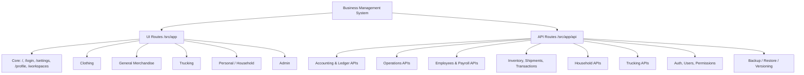

# Repository Sitemap Tree & Diagram (2026-02-20)

## Overview

- UI pages: 127
- API routes: 235
- Clothing pages: 40
- General merchandise pages: 41
- Trucking pages: 26
- Personal pages: 9
- Admin pages: 3

## Diagram

## Full UI Route Tree

- /admin/backup-restore
- /admin/change-log
- /admin
- /api/docs
- /clothing/accounting/balance-sheet
- /clothing/accounting/expenses
- /clothing/accounting/journal
- /clothing/accounting/ledger
- /clothing/accounting
- /clothing/accounting/profit-loss
- /clothing/employees/attendance
- /clothing/employees/calendar
- /clothing/employees/cash-advance
- /clothing/employees/dashboard
- /clothing/employees/employee-loans
- /clothing/employees/expenses
- /clothing/employees/leave-tracker
- /clothing/employees/notifications
- /clothing/employees/payroll
- /clothing/employees/schedules
- /clothing/employees/settings
- /clothing/employees/team/[id]
- /clothing/employees/team
- /clothing/employees/thirteenth-month-pay
- /clothing/ledger
- /clothing/operations/business-intelligence
- /clothing/operations/checkout-links
- /clothing/operations/customers/[id]
- /clothing/operations/customers
- /clothing/operations/dashboard
- /clothing/operations/dispatching
- /clothing/operations/dispatch
- /clothing/operations/inventory
- /clothing/operations/message-templates
- /clothing/operations/messaging
- /clothing/operations/notifications
- /clothing/operations/post-template
- /clothing/operations/prices
- /clothing/operations/products
- /clothing/operations/settings
- /clothing/operations/shipments
- /clothing/operations/sorting-distribution
- /clothing/operations/transactions
- /clothing/users
- /forgot-password
- /general-merchandise/accounting/balance-sheet
- /general-merchandise/accounting/expenses
- /general-merchandise/accounting/journal
- /general-merchandise/accounting/ledger
- /general-merchandise/accounting
- /general-merchandise/accounting/profit-loss
- /general-merchandise/employees/attendance
- /general-merchandise/employees/calendar
- /general-merchandise/employees/cash-advance
- /general-merchandise/employees/dashboard
- /general-merchandise/employees/employee-loans
- /general-merchandise/employees/expenses
- /general-merchandise/employees/leave-tracker
- /general-merchandise/employees/notifications
- /general-merchandise/employees
- /general-merchandise/employees/payroll
- /general-merchandise/employees/schedules
- /general-merchandise/employees/settings
- /general-merchandise/employees/team/[id]
- /general-merchandise/employees/team
- /general-merchandise/employees/thirteenth-month-pay
- /general-merchandise/operations/business-intelligence
- /general-merchandise/operations/checkout-links
- /general-merchandise/operations/customers/[id]
- /general-merchandise/operations/customers
- /general-merchandise/operations/dashboard
- /general-merchandise/operations/dispatching
- /general-merchandise/operations/dispatch
- /general-merchandise/operations/due-dates
- /general-merchandise/operations/inventory
- /general-merchandise/operations/message-templates
- /general-merchandise/operations/messaging
- /general-merchandise/operations/notifications
- /general-merchandise/operations
- /general-merchandise/operations/post-template
- /general-merchandise/operations/prices
- /general-merchandise/operations/products
- /general-merchandise/operations/settings
- /general-merchandise/operations/shipments
- /general-merchandise/operations/sorting-distribution
- /general-merchandise/operations/transactions
- /login
- /
- /personal/accounts
- /personal/budgets
- /personal/categories
- /personal/dashboard
- /personal/expenses
- /personal/income
- /personal
- /personal/reports
- /personal/settings
- /profile
- /reset-password
- /settings
- /trucking/analytics/profitability
- /trucking/employees/attendance
- /trucking/employees/calendar
- /trucking/employees/cash-advance
- /trucking/employees/dashboard
- /trucking/employees/employee-loans
- /trucking/employees/expenses
- /trucking/employees/leave-tracker
- /trucking/employees/notifications
- /trucking/employees/payroll
- /trucking/employees/schedules
- /trucking/employees/settings
- /trucking/employees/team/[id]
- /trucking/employees/team
- /trucking/employees/thirteenth-month-pay
- /trucking/employees/trips
- /trucking/expenses
- /trucking/invoices
- /trucking/operations/fleet-registry/[id]
- /trucking/operations/fleet-registry
- /trucking/operations
- /trucking/operations/trips
- /trucking/operations/truck-assignments
- /trucking/operations/vehicle-assignments
- /trucking/payments
- /trucking/reports/cashflow
- /workspaces

## Full API Route Tree

- /api/accounting/balance-sheet
- /api/accounting/journal
- /api/accounting/ledger
- /api/accounting/manual-journal
- /api/accounting/opening-balance
- /api/accounting/profit-loss/details
- /api/accounting/profit-loss
- /api/accounting/recurring-payments/drafts/approve
- /api/accounting/recurring-payments/drafts
- /api/accounting/recurring-payments/drafts/skip
- /api/accounting/recurring-payments/generate
- /api/accounting/recurring-payments/templates
- /api/accounting/transit-build
- /api/attendance/apply-leave
- /api/attendance
- /api/auth/[...nextauth]
- /api/auth/password/forgot
- /api/auth/password/reset
- /api/auth/redirect
- /api/backup
- /api/backup/[timestamp]/[filename]
- /api/bundles
- /api/cash-advances
- /api/change-log
- /api/checkout-links
- /api/clothing-attendance
- /api/clothing/employees/dashboard
- /api/clothing/operations/products/shipping-fee-calculator
- /api/clothing/operations/settings/change-log
- /api/conversations/[id]/messages
- /api/conversations/[id]/read
- /api/conversations
- /api/conversations/unread-count
- /api/customers/export
- /api/customers/[id]/additional-info/add
- /api/customers/[id]/additional-info
- /api/customers/[id]/orders
- /api/customers/[id]/payments/[paymentId]
- /api/customers/[id]/payments
- /api/customers/[id]/refunds/[refundId]
- /api/customers/[id]/refunds
- /api/customers/[id]
- /api/customers/[id]/transactions
- /api/customers/import
- /api/customers
- /api/customers/with-all-addresses
- /api/customers/with-shopee
- /api/dispatch/orders
- /api/docs/spec
- /api/employee-automation-settings
- /api/employees/dashboard
- /api/employees/[id]
- /api/employees/[id]/salary-history
- /api/employees/restore
- /api/employees
- /api/expenses/[id]
- /api/expenses
- /api/general-merchandise/accounting/balance-sheet
- /api/general-merchandise/accounting/journal
- /api/general-merchandise/accounting/ledger
- /api/general-merchandise/accounting/manual-journal
- /api/general-merchandise/accounting/opening-balance
- /api/general-merchandise/accounting/profit-loss/details
- /api/general-merchandise/accounting/profit-loss
- /api/general-merchandise/accounting/recurring-payments/drafts/approve
- /api/general-merchandise/accounting/recurring-payments/drafts
- /api/general-merchandise/accounting/recurring-payments/drafts/skip
- /api/general-merchandise/accounting/recurring-payments/generate
- /api/general-merchandise/accounting/recurring-payments/templates
- /api/general-merchandise/accounting/transit-build
- /api/general-merchandise/attendance/apply-leave
- /api/general-merchandise/attendance
- /api/general-merchandise/bundles
- /api/general-merchandise/cash-advances
- /api/general-merchandise/checkout-links
- /api/general-merchandise/customers/export
- /api/general-merchandise/customers/[id]/additional-info/add
- /api/general-merchandise/customers/[id]/additional-info
- /api/general-merchandise/customers/[id]/orders
- /api/general-merchandise/customers/[id]/payments
- /api/general-merchandise/customers/[id]/refunds/[refundId]
- /api/general-merchandise/customers/[id]/refunds
- /api/general-merchandise/customers/[id]
- /api/general-merchandise/customers/[id]/transactions
- /api/general-merchandise/customers/import
- /api/general-merchandise/customers
- /api/general-merchandise/customers/with-all-addresses
- /api/general-merchandise/customers/with-shopee
- /api/general-merchandise/dispatch/orders
- /api/general-merchandise/employee-automation-settings
- /api/general-merchandise/employees/dashboard
- /api/general-merchandise/employees
- /api/general-merchandise/expenses
- /api/general-merchandise/generate-distribution
- /api/general-merchandise/generate-in-transit-invoice
- /api/general-merchandise/generate-invoice
- /api/general-merchandise/generate-packing-list
- /api/general-merchandise/inventory/check-stock
- /api/general-merchandise/inventory/movements
- /api/general-merchandise/invoices/calculate-weights
- /api/general-merchandise/invoices/customer-orders
- /api/general-merchandise/invoices/[id]/tickbox
- /api/general-merchandise/invoices
- /api/general-merchandise/item-weights
- /api/general-merchandise/leave-requests/[id]
- /api/general-merchandise/leave-requests
- /api/general-merchandise/message-templates
- /api/general-merchandise/mix-and-match
- /api/general-merchandise/operations/notifications
- /api/general-merchandise/operations/products/shipping-fee-calculator
- /api/general-merchandise/operations/settings/change-log
- /api/general-merchandise/payroll/cleanup
- /api/general-merchandise/payroll/generate-payslips
- /api/general-merchandise/payroll/generate
- /api/general-merchandise/payroll
- /api/general-merchandise/payroll/sync-lwop
- /api/general-merchandise/post-template-notice
- /api/general-merchandise/prices
- /api/general-merchandise/products/[id]
- /api/general-merchandise/products
- /api/general-merchandise/products/transit-build
- /api/general-merchandise/schedules
- /api/general-merchandise/shipments/[id]
- /api/general-merchandise/shipments/[id]/transit-build
- /api/general-merchandise/shipments/[id]/transit-reclass
- /api/general-merchandise/shipments
- /api/general-merchandise/sorting-distribution
- /api/general-merchandise/thirteenth-month-pay/[recordId]/status
- /api/general-merchandise/thirteenth-month-pay
- /api/general-merchandise/transactions/payments/bulk
- /api/general-merchandise/transactions
- /api/generate-distribution
- /api/generate-in-transit-invoice
- /api/generate-invoice
- /api/generate-packing-list
- /api/google-drive/sync-files
- /api/health
- /api/household/accounts
- /api/household/budgets
- /api/household/expenses/[id]
- /api/household/expenses
- /api/household/income
- /api/household/recurring-payments/generate
- /api/household/recurring-payments
- /api/internal/inventory/controls
- /api/inventory/check-stock
- /api/inventory/movements
- /api/invoices/calculate-weights
- /api/invoices/customer-orders
- /api/invoice-settings/reset
- /api/invoice-settings
- /api/invoices/[id]/tickbox
- /api/invoices
- /api/item-weights
- /api/leave-requests/[id]
- /api/leave-requests
- /api/marketplace/modules
- /api/message-templates
- /api/mix-and-match
- /api/modules/config/[moduleId]
- /api/modules/config
- /api/modules/download
- /api/modules/install
- /api/modules/performance
- /api/modules/reload
- /api/modules
- /api/modules/uninstall
- /api/modules/update
- /api/operations/notifications
- /api/payroll/cleanup
- /api/payroll/generate-payslips
- /api/payroll/generate
- /api/payroll
- /api/payroll/sync-lwop
- /api/permissions/check
- /api/post-template-notice
- /api/prices/[id]
- /api/prices
- /api/products/[id]
- /api/products
- /api/products/transit-build
- /api/restore
- /api/schedules
- /api/settings/invoice
- /api/settings/payment-cards/[id]
- /api/settings/payment-cards
- /api/settings/transactions
- /api/shipments/[id]
- /api/shipments/[id]/transit-build
- /api/shipments/[id]/transit-reclass
- /api/shipments
- /api/sorting-distribution
- /api/thirteenth-month-pay/[recordId]/status
- /api/thirteenth-month-pay
- /api/transactions/[id]
- /api/transactions/payments/bulk
- /api/transactions
- /api/trucking/analytics/profitability
- /api/trucking/attendance/apply-leave
- /api/trucking/attendance
- /api/trucking/cash-advances
- /api/trucking/employee-automation-settings
- /api/trucking/employees/[id]
- /api/trucking/employees/[id]/salary-history
- /api/trucking/employees
- /api/trucking/expenses/[id]
- /api/trucking/expenses
- /api/trucking/fleet-vehicles/[identifier]
- /api/trucking/fleet-vehicles
- /api/trucking/invoices/generate
- /api/trucking/invoices
- /api/trucking/leave-requests/[id]
- /api/trucking/leave-requests
- /api/trucking/payments
- /api/trucking/payroll/cleanup
- /api/trucking/payroll/generate-payslips
- /api/trucking/payroll/generate
- /api/trucking/payroll
- /api/trucking/payroll/sync-lwop
- /api/trucking/schedules
- /api/trucking/thirteenth-month-pay/[recordId]/status
- /api/trucking/thirteenth-month-pay
- /api/trucking/trips/[id]/finalize
- /api/trucking/trips/[id]
- /api/trucking/trips
- /api/trucking/vehicle-assignments/[id]
- /api/trucking/vehicle-assignments
- /api/users/[id]/permissions
- /api/users/[id]
- /api/users/messaging
- /api/users/profile/photo
- /api/users/profile
- /api/users
- /api/version-history
- /api/version-history/sync
