# Webapp Sitemap (Mermaid)

This sitemap is generated from Next.js App Router routes found under `src/app/**/page.*`.

- Includes user-facing pages (and the `/api/docs` page).
- Excludes API endpoints implemented as `src/app/api/**/route.ts`.

```mermaid
flowchart TD
  Home["/ (Home)"]

  %% Top-level groupings (not URL routes)
  AuthRoot(["Auth"])
  AccountRoot(["Account"])
  AdminRoot(["Admin"])
  ClothingRoot(["Clothing"])
  TruckingRoot(["Trucking"])
  DocsRoot(["Docs"])

  Home --> AuthRoot
  Home --> AccountRoot
  Home --> AdminRoot
  Home --> ClothingRoot
  Home --> TruckingRoot
  Home --> DocsRoot

  %% Auth
  Login["/login"]
  ForgotPassword["/forgot-password"]
  ResetPassword["/reset-password"]

  AuthRoot --> Login
  AuthRoot --> ForgotPassword
  AuthRoot --> ResetPassword

  %% Account
  Profile["/profile"]
  Settings["/settings"]
  Workspaces["/workspaces"]

  AccountRoot --> Profile
  AccountRoot --> Settings
  AccountRoot --> Workspaces

  %% Admin
  AdminHome["/admin"]
  AdminChangeLog["/admin/change-log"]
  AdminRoot --> AdminHome
  AdminRoot --> AdminChangeLog

  %% Docs
  ApiDocs["/api/docs"]
  DocsRoot --> ApiDocs

  %% Clothing
  ClothingUsers["/clothing/users"]
  ClothingRoot --> ClothingUsers

  ClothingEmployeesRoot(["Clothing · Employees"])
  ClothingOperationsRoot(["Clothing · Operations"])
  ClothingRoot --> ClothingEmployeesRoot
  ClothingRoot --> ClothingOperationsRoot

  %% Clothing · Employees
  ClothingEmployeesDashboard["/clothing/employees/dashboard"]
  ClothingEmployeesAttendance["/clothing/employees/attendance"]
  ClothingEmployeesCalendar["/clothing/employees/calendar"]
  ClothingEmployeesSchedules["/clothing/employees/schedules"]
  ClothingEmployeesPayroll["/clothing/employees/payroll"]
  ClothingEmployeesExpenses["/clothing/employees/expenses"]
  ClothingEmployeesCashAdvance["/clothing/employees/cash-advance"]
  ClothingEmployeesEmployeeLoans["/clothing/employees/employee-loans"]
  ClothingEmployeesLeaveTracker["/clothing/employees/leave-tracker"]
  ClothingEmployeesNotifications["/clothing/employees/notifications"]
  ClothingEmployeesThirteenthMonthPay["/clothing/employees/thirteenth-month-pay"]
  ClothingEmployeesSettings["/clothing/employees/settings"]
  ClothingEmployeesTeam["/clothing/employees/team"]
  ClothingEmployeesTeamId["/clothing/employees/team/[id]"]

  ClothingEmployeesRoot --> ClothingEmployeesDashboard
  ClothingEmployeesRoot --> ClothingEmployeesAttendance
  ClothingEmployeesRoot --> ClothingEmployeesCalendar
  ClothingEmployeesRoot --> ClothingEmployeesSchedules
  ClothingEmployeesRoot --> ClothingEmployeesPayroll
  ClothingEmployeesRoot --> ClothingEmployeesExpenses
  ClothingEmployeesRoot --> ClothingEmployeesCashAdvance
  ClothingEmployeesRoot --> ClothingEmployeesEmployeeLoans
  ClothingEmployeesRoot --> ClothingEmployeesLeaveTracker
  ClothingEmployeesRoot --> ClothingEmployeesNotifications
  ClothingEmployeesRoot --> ClothingEmployeesThirteenthMonthPay
  ClothingEmployeesRoot --> ClothingEmployeesSettings
  ClothingEmployeesRoot --> ClothingEmployeesTeam
  ClothingEmployeesTeam --> ClothingEmployeesTeamId

  %% Clothing · Operations
  ClothingOperationsDashboard["/clothing/operations/dashboard"]
  ClothingOperationsInventory["/clothing/operations/inventory"]
  ClothingOperationsProducts["/clothing/operations/products"]
  ClothingOperationsPrices["/clothing/operations/prices"]
  ClothingOperationsCustomers["/clothing/operations/customers"]
  ClothingOperationsCustomerId["/clothing/operations/customers/[id]"]
  ClothingOperationsMessaging["/clothing/operations/messaging"]
  ClothingOperationsMessageTemplates["/clothing/operations/message-templates"]
  ClothingOperationsNotifications["/clothing/operations/notifications"]
  ClothingOperationsDispatch["/clothing/operations/dispatch"]
  ClothingOperationsDispatching["/clothing/operations/dispatching"]
  ClothingOperationsShipments["/clothing/operations/shipments"]
  ClothingOperationsTransactions["/clothing/operations/transactions"]
  ClothingOperationsCheckoutLinks["/clothing/operations/checkout-links"]
  ClothingOperationsBusinessIntelligence["/clothing/operations/business-intelligence"]
  ClothingOperationsPostTemplate["/clothing/operations/post-template"]
  ClothingOperationsSortingDistribution["/clothing/operations/sorting-distribution"]
  ClothingOperationsSettings["/clothing/operations/settings"]

  ClothingOperationsRoot --> ClothingOperationsDashboard
  ClothingOperationsRoot --> ClothingOperationsInventory
  ClothingOperationsRoot --> ClothingOperationsProducts
  ClothingOperationsRoot --> ClothingOperationsPrices
  ClothingOperationsRoot --> ClothingOperationsCustomers
  ClothingOperationsCustomers --> ClothingOperationsCustomerId
  ClothingOperationsRoot --> ClothingOperationsMessaging
  ClothingOperationsRoot --> ClothingOperationsMessageTemplates
  ClothingOperationsRoot --> ClothingOperationsNotifications
  ClothingOperationsRoot --> ClothingOperationsDispatch
  ClothingOperationsRoot --> ClothingOperationsDispatching
  ClothingOperationsRoot --> ClothingOperationsShipments
  ClothingOperationsRoot --> ClothingOperationsTransactions
  ClothingOperationsRoot --> ClothingOperationsCheckoutLinks
  ClothingOperationsRoot --> ClothingOperationsBusinessIntelligence
  ClothingOperationsRoot --> ClothingOperationsPostTemplate
  ClothingOperationsRoot --> ClothingOperationsSortingDistribution
  ClothingOperationsRoot --> ClothingOperationsSettings

  %% Trucking
  TruckingExpenses["/trucking/expenses"]
  TruckingRoot --> TruckingExpenses

  TruckingEmployeesRoot(["Trucking · Employees"])
  TruckingOperationsRoot(["Trucking · Operations"])
  TruckingRoot --> TruckingEmployeesRoot
  TruckingRoot --> TruckingOperationsRoot

  %% Trucking · Employees
  TruckingEmployeesDashboard["/trucking/employees/dashboard"]
  TruckingEmployeesAttendance["/trucking/employees/attendance"]
  TruckingEmployeesCalendar["/trucking/employees/calendar"]
  TruckingEmployeesSchedules["/trucking/employees/schedules"]
  TruckingEmployeesPayroll["/trucking/employees/payroll"]
  TruckingEmployeesExpenses["/trucking/employees/expenses"]
  TruckingEmployeesCashAdvance["/trucking/employees/cash-advance"]
  TruckingEmployeesEmployeeLoans["/trucking/employees/employee-loans"]
  TruckingEmployeesLeaveTracker["/trucking/employees/leave-tracker"]
  TruckingEmployeesNotifications["/trucking/employees/notifications"]
  TruckingEmployeesThirteenthMonthPay["/trucking/employees/thirteenth-month-pay"]
  TruckingEmployeesTrips["/trucking/employees/trips"]
  TruckingEmployeesSettings["/trucking/employees/settings"]
  TruckingEmployeesTeam["/trucking/employees/team"]
  TruckingEmployeesTeamId["/trucking/employees/team/[id]"]

  TruckingEmployeesRoot --> TruckingEmployeesDashboard
  TruckingEmployeesRoot --> TruckingEmployeesAttendance
  TruckingEmployeesRoot --> TruckingEmployeesCalendar
  TruckingEmployeesRoot --> TruckingEmployeesSchedules
  TruckingEmployeesRoot --> TruckingEmployeesPayroll
  TruckingEmployeesRoot --> TruckingEmployeesExpenses
  TruckingEmployeesRoot --> TruckingEmployeesCashAdvance
  TruckingEmployeesRoot --> TruckingEmployeesEmployeeLoans
  TruckingEmployeesRoot --> TruckingEmployeesLeaveTracker
  TruckingEmployeesRoot --> TruckingEmployeesNotifications
  TruckingEmployeesRoot --> TruckingEmployeesThirteenthMonthPay
  TruckingEmployeesRoot --> TruckingEmployeesTrips
  TruckingEmployeesRoot --> TruckingEmployeesSettings
  TruckingEmployeesRoot --> TruckingEmployeesTeam
  TruckingEmployeesTeam --> TruckingEmployeesTeamId

  %% Trucking · Operations
  TruckingOperationsHome["/trucking/operations"]
  TruckingOperationsTrips["/trucking/operations/trips"]
  TruckingOperationsFleetRegistry["/trucking/operations/fleet-registry"]
  TruckingOperationsFleetRegistryId["/trucking/operations/fleet-registry/[id]"]
  TruckingOperationsVehicleAssignments["/trucking/operations/vehicle-assignments"]
  TruckingOperationsTruckAssignments["/trucking/operations/truck-assignments"]

  TruckingOperationsRoot --> TruckingOperationsHome
  TruckingOperationsRoot --> TruckingOperationsTrips
  TruckingOperationsRoot --> TruckingOperationsFleetRegistry
  TruckingOperationsFleetRegistry --> TruckingOperationsFleetRegistryId
  TruckingOperationsRoot --> TruckingOperationsVehicleAssignments
  TruckingOperationsRoot --> TruckingOperationsTruckAssignments
```

